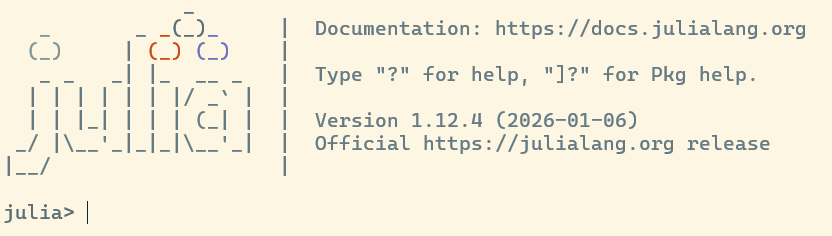
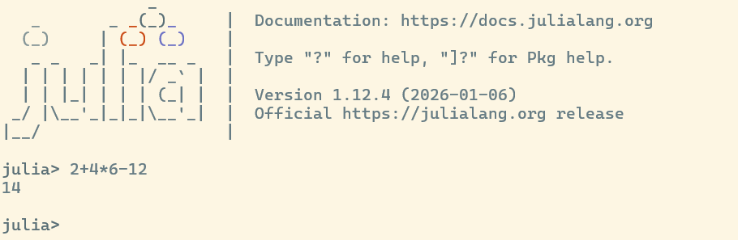
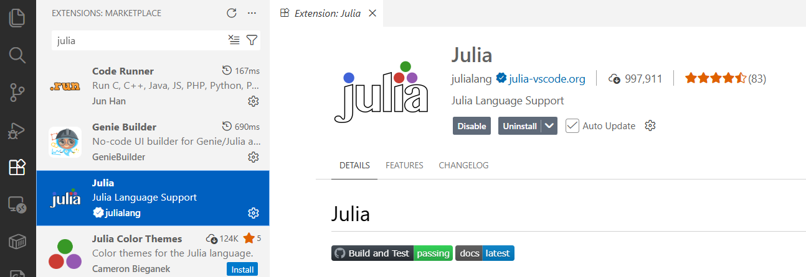
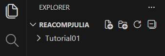
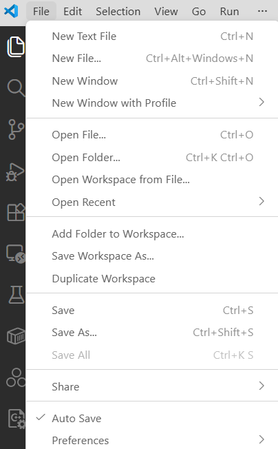
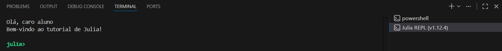

Para instalar a linguagen Julia em seu computador siga as instruções deste _link_ [JULIA](https://julialang.org/downloads/){.text-decoration-none}.

Julia possui um ambiente REPL (_read-eval-print loop_) para executar pequenas instruções diretamente no console, sem a necessidade de salvar o código em um arquivo e compilar, por exemplo. Para testar essa funcionalidade digite `julia` em seu terminal. 



Se seu terminal aparecer algo semelhante à imagem acima, você conseguiu instalar Julia corretamente e está no ambiente REPL. Fique à vontade para experimentar o ambiente. Após escrever seu comando, tecle `Enter`. Por exemplo,




Para obter ajuda digite `?`. O terminal mudará de `julia>` para `help?>`. No modo de ajuda, você pode obter informações como:

- Documentação de funções e macros: `?print` ou `?@time`
- Definições de tipos e estruturas: `?String` ou `?struct`
- Operdores e sintaxe: `?+` ou `?&&`

Para sair do ambiente REPL digite `exit()`.

# Instalação de bibliotecas

No ambiente REPL, digite `]` (colchete de fechamento). O ambiente entrará no ambiente global de pacotes. O terminal mudará de `julia>` para `(@v1.12) pkg>`, onde `1.12` é a versão instalada. 

Para instalar um pacote, digite `add <nome_do_pacote>` e tecle `Enter`. Por exemplo, `add Pluto` irá instalar a biblioteca para criar _notebooks_ reativos em Julia. A tecla `backspace` volta ao estado padrão do REPL.

```{.console code-line-numbers="false"}
julia> ]
(@v1.12) pkg> add Pluto
(@v1.12) pkg> status
(@v1.12) pkg> remove Pluto
```

O comando `status` lista todos os pacotes instalados. Já o comando `remove <nome_do_pacote>` remove o pacote do ambiente ativo.

A recomendação da comunidade Julia é nunca instalar muitos pacotes no ambiente global (`@v1.x`). Pois, se você instalar um pacote com versão v1.0 globalmente e, daqui a um mês, tentar rodar um projeto que precisa da versão v0.2, pode haver um conflito de versões que "quebra" o Julia. Recomenda-se deixar no global apenas ferramentas utilitárias que você usa em todos os lugares. 

Iremos aprender como instalar pacotes localmente, porém antes vamos criar uma pasta para noss aula.

Digitando `;` (ponto e vírgula), Julia entrará no modo _shell_, no qual podemos realizar os comandos comuns de um terminal. Por exemplo, realize o seguintes comando no modo  _shell_ de Julia:

- `ls` : mostra os arquivos e pastas do diretório atual.
- `cd Documents` : entra na pasta `Documents` (_escolha uma pasta adequada_).
- `mkdir REACompJulia` : cria a pasta `REACompJulia`.
- `cd REACompJulia` : entra na pasta pasta `REACompJulia`.
- `ls` : mostra que a pasta `REACompJulia` está vazia, pois ela foi recém criada.

Resumindo:

```{.console code-line-numbers="false"}
julia> ;
shell> ls
shell> cd Documents
shell> mkdir REACompJulia
shell> cd REACompJulia
shell> ls
```

Agora que você aprendeu como criar uma pasta, crie uma chamada `Tutorial01` dentro de `REACompJulia` e, em seguida, entre nela pelo terminal. Depois, tecle `backspace` para voltar ao modo padrão. 

Vamos entrar no modo de instalação de pacotes (digite `]`). O terminal mudará para `(@v1.12) pkg>`, indicando que qualquer pacote adicionado será instalado no modo global. Digite `activate .` e tecle `Enter`. Julia irá mostrar a seguinte mensagem: 

```{.console code-line-numbers="false"}
Activating new project at '...\REACompJulia\Tutorial01'  
```

O terminal mudará para `(Tutorial01) pkg>`. Isso indica que qualquer pacote adicionado será instalado no modo privado, isto é, somente para este projeto.  

```{.console code-line-numbers="false"}
julia> ]
(@v1.12) pkg> activate .
(Tutorial01) pkg> 
```


::: {.callout-tip}
Outra alternativa é criar as pastas manualmente e, em ato contínuo, abrir o terminal na pasta `Tutorial01`. Quando o comando `julia --project=.` for acionado no terminal, o REPL será aberto com a pasta atual de trabalho e a sessão já com o projeto ativado.
:::

Dessa forma, podemos instalar nossos pacotes.

```{.console code-line-numbers="false"}
(Tutorial01) pkg> add Pluto
(Tutorial01) pkg> <backspace>
julia>
```

Você notará que foram criados dois arquivos: `Manifest.toml` e `Project.toml`. 

```{.console code-line-numbers="false"}
julia> ;
shell> ls
Manifest.toml  Project.toml 
```

O arquivo `Project.toml` lista os pacotes que você decidiu instalar diretamente e informações básicas do projeto. Ele diz: "Eu preciso do pacote Pluto para rodar".

Já o arquivo `Manifest.toml` é a "árvore genealógica" completa do seu ambiente. Ele contém a versão exata de todos os pacotes instalados (incluindo as dependências das dependências) e o "hash" (assinatura digital) de cada um. Ele garante a reprodutibilidade absoluta. Se você instalou o `DataFrames v1.6.1`, o Manifest garante que ninguém que baixe seu código use a `v1.7.0` por acidente, o que poderia quebrar algo.

::: {.callout-important}
Sem esses arquivos, se você atualizar o Julia ou seus pacotes daqui a seis meses, por exemplo, seu código antigo pode parar de funcionar porque alguma função mudou. Com eles, você pode reconstruir o ambiente exato de seis meses atrás usando apenas o comando `instantiate`. É por essa razão que recomendamos que os pacotes não sejam instalados em nível global, mas em cada projeto.
:::

Regra de ouro em Julia:

> Todo projeto tem seu próprio ambiente.
> Nunca misture código, dados e dependências sem um `Project.toml`.

# Executando um script

Em Julia, executamos um script com o comando `julia <nome_do_script>.jl`. Durante a execução, o Julia compila automaticamente as funções que precisam ser executadas.

Como exemplo, vamos criar o arquivo `saudacao.jl` na pasta `Tutorial01`, que criamos na sessão anterior. Em seguida, digite o seguinte conteúdo no arquivo:

```{.julia}
print("Qual o seu nome? ")
nome = readline()
println("Olá, ", nome, ", bem-vindo ao tutorial de Julia.")
```
O texto com aspas duplas é chamado de _string_. Salve o arquivo, abra o terminal padrão do seu sistema operacional na pasta `Tutorial01` e insira o comando abaixo:

```{.console code-line-numbers="false"}
julia saudacao.jl
```

O programa irá perguntar seu nome. Após digitar seu nome e teclar `Enter`, o programa irá mostrar uma mensagem de saudação.


## Integração com Visual Studio Code

Inicie seu [VS Code](https://code.visualstudio.com/){.text-decoration-none}. Na lateral esquerda, clique no ícone de extensões (um botão com quatro quadrados) ou digite `Ctrt+Shift+X` para abir o painel de extensões. Em seguida, digite `julia` na barra de pesquisa e instale a extensão Julia Language Support. Pronto, pode fechar a aba da extensão e o painel de extensões.



Abra o explorador, o primeiro botão na barra vertical esquerda com ícone de duas folhas sobrepostas ou digite `Ctrt+Shift+E`. É nesse painel que você verá todas as suas pastas e arquivos. 

Clique em `Open Fold` e selecione uma pasta recem criada, por exemplo `REACompJulia`.

Alternativamente, dentro da pasta `REACompJulia`, com o botão direito do _mouse_ selecione a opção `Abrir no Terminal`. Em seguida, digite `code .` e se abrirá uma instância do VS Code na pasta atual.

No explorador, passe o _mouse_ sob o nome do "projeto" que aparecerá os ícones de criar arquivo, criar pasta, atualizar e retrair pastas, respectivamente.



Dentro da pasta `Tutorial01`, crie um arquivo chamado `hello.jl` e feche o explorador. Antes de digitar qualquer código, vamos habilitar o salvamento automático. No menu `File`, escolha a opção `Auto Save`:



No arquivo `hello.jl`, digite o código abaixo 

```julia
print("Olá, ")
print("caro aluno\n")
println("Bem-vindo ao tutorial de Julia!")
```

Usamos as funções `print` e `println` para exibir mensagens. A diferença é que esta última insere uma quebra de linha no final. O caractere especial de escape de nova linha é `\n`.

Há três maneiras de avaliar esse código no VS Code. 

- `Shift+Enter`: avalia uma linha e move o cursor para a proxima linha
- `Ctrl+Enter`: avalia uma linha e mantém o cursor na mesma linha
- `Alt+Enter` avalia o arquvio inteiro

Para nosso código, qualquer opção é válida, pois contém somente uma linha. Ao realizar um desses comandos pela primeira vez, uma janela de terminal será aberta com o REPL de Julia. Se você ver a mensagem abaixo em seu ambiente de desenvolvimento, parabéns.



::: {.callout-note icon="false" title="Exercício de Fixação"}
Imprima o texto anterior usando somente `println` duas vezes. Em seguida, imprima o mesmo texto usando somente um `println`. Lembre-se de manter os espaços e quebras de linha. 
:::

::: {.callout-tip title="Solução (clique para ver)" collapse="true"}

Solução com dois `println`
```{.julia code-line-numbers="false"}
println("Olá, caro aluno")
println("Bem-vindo ao tutorial de Julia!")
```
Solução com um `println`
```{.julia code-line-numbers="false"}
println("Olá, caro aluno\nBem-vindo ao tutorial de Julia!")
```
:::